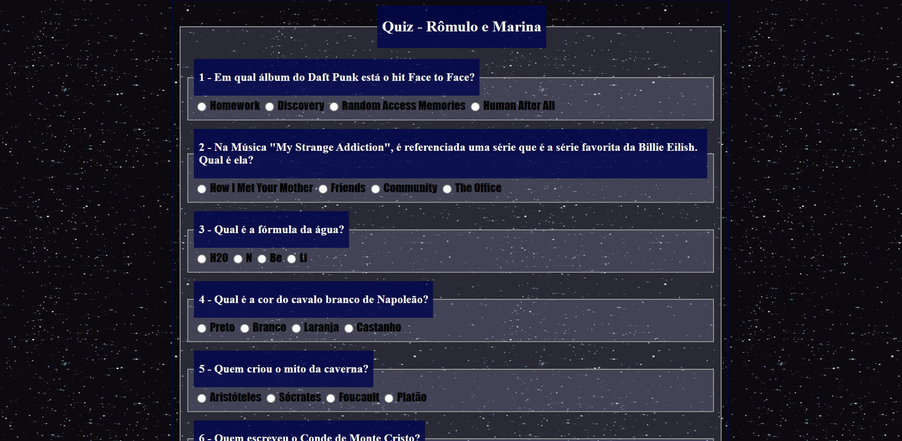
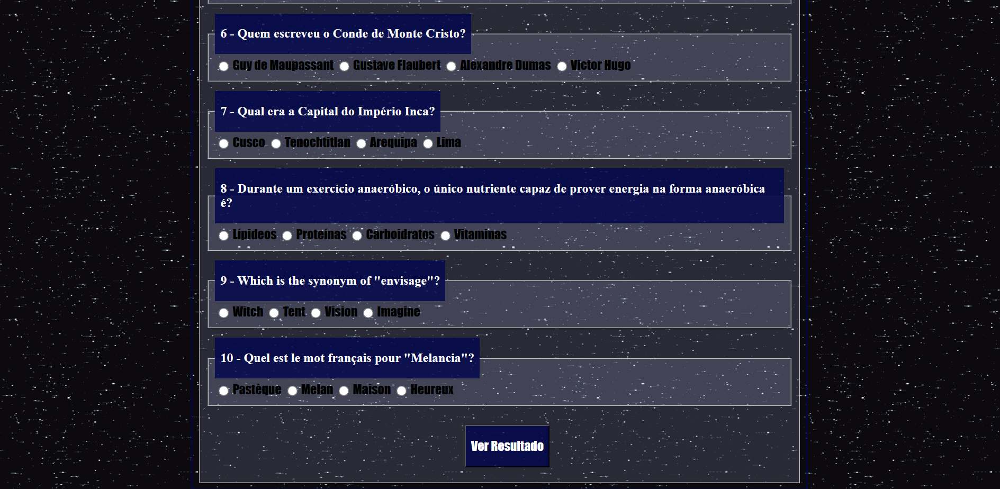
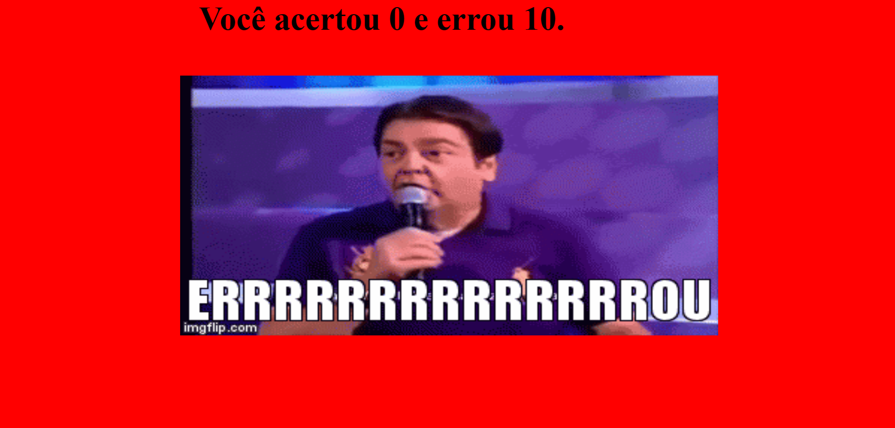
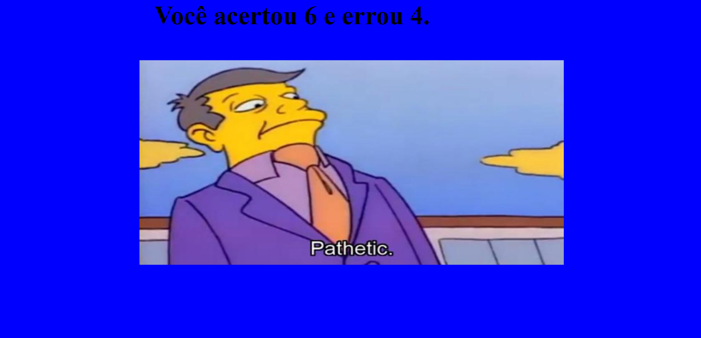
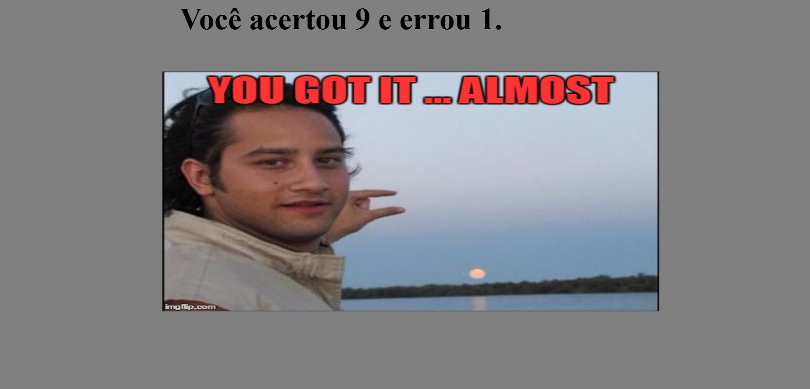

# quizAtividade
uma atividade feita em dupla com HTML, CSS e Javascript priorizando o javascript para treinar um formato de quiz  

<h3>Algumas imagens do site que fizemos. Totalmente feio. Era só pra treinar o javascript</h3>
 

  <h4>Algumas perguntas fáceis</h4>
  

 

  

 

  <h4>Todas as perguntas tem o required</h4>
  

  <h4>Tela se errar todas</h4>
  

  <h4>Tela se errar algumas</h4>
  

  <h4>Tela se errar uma</h4>
  

  <h4>Tela se errar todas</h4>
  

